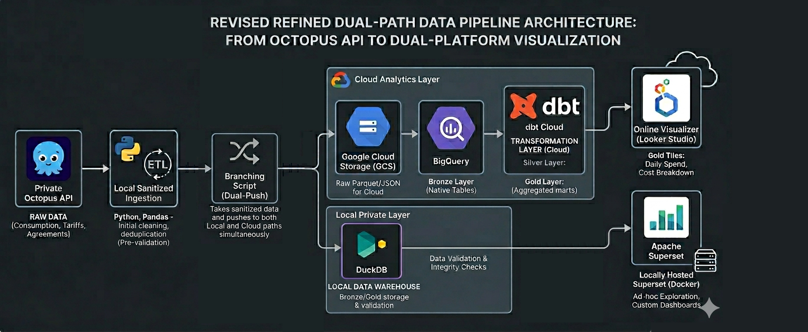
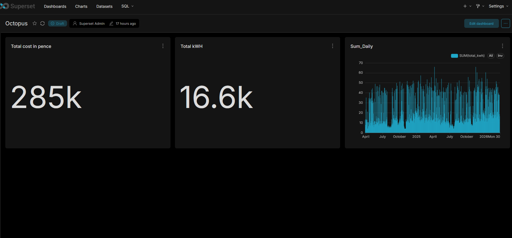
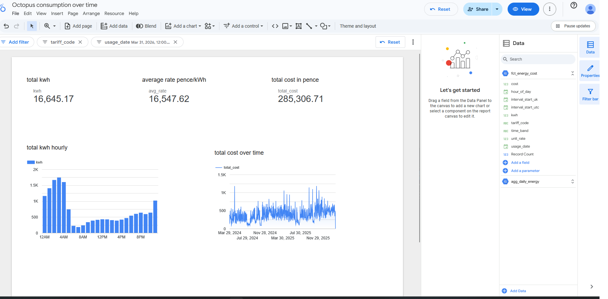

# Octopus Energy 30-Minute Analytics

DE Zoomcamp capstone project for building an end-to-end batch pipeline around anonymized Octopus Energy electricity usage data.

This project uses a hybrid local/cloud architecture:

- local WSL Python ingestion to keep private identifiers out of the cloud
- GCP infrastructure provisioned with Terraform
- GCS as the data lake
- BigQuery as the warehouse
- dbt for transformations
- Kestra for local orchestration
- dbt Cloud for cloud transformation jobs
- Superset for local exploration
- Looker Studio for shareable online dashboards

The design intentionally separates private raw ingestion from cloud analytics so the project remains both portfolio-ready and privacy-conscious.
It is also intentionally built as two parallel layers of the same project:

- a local private layer for ingestion, sanitization, DuckDB validation, and local Superset work
- a cloud analytics layer for GCS, BigQuery, dbt Cloud, and Looker Studio

---

## 0. Executive Summary

This project ingests 30-minute Octopus Energy electricity usage data, removes private identifiers locally, writes sanitized bronze data to GCS and BigQuery, transforms it with dbt, and serves it to dashboards.

Architecture summary:



This hybrid design is the core project decision:

- local ingestion protects private account identifiers
- cloud storage and transformation make the project reproducible and reviewable
- dbt Cloud provides the managed transformation DAG for the warehouse layer
- the project is intentionally operated across both a local data path and a cloud data path in parallel

---

## 1. Problem Statement

The goal is to analyze domestic electricity consumption at 30-minute granularity and turn it into a reproducible analytics workflow that can answer questions such as:

- how much electricity is used each day
- how cost changes by tariff and time band
- when peak and night usage occur
- how a raw meter consumption feed becomes dashboard-ready business metrics

The dataset is sensitive because the Octopus API returns identifiers tied to a real energy account. For that reason, raw ingestion happens locally first, and only anonymized analytical data is pushed to cloud storage and the warehouse.

---

## 2. Why A Hybrid Approach

This project uses a hybrid architecture instead of a fully cloud-native ingestion flow for one main reason: privacy.

Why local first:

- the Octopus API requires sensitive credentials
- raw payloads are linked to a real MPAN / meter identity
- it is safer to remove account-identifying fields before any upload

Why cloud after sanitization:

- BigQuery is a better long-term analytics layer than local DuckDB alone
- GCS gives a simple, cheap, Parquet-based data lake
- dbt Cloud and Looker Studio work naturally against BigQuery
- the cloud path is more reproducible for reviewers than a local-only project

This creates two parallel working layers:

- local private layer: local Python ingestion, local DuckDB bronze, local dbt validation, local Superset exploration
- cloud analytics layer: sanitized Parquet in GCS, sanitized bronze in BigQuery, dbt Cloud transformations, Looker Studio reporting

These two layers coexist rather than replace one another:

- the local layer is the trusted ingestion and privacy boundary
- the cloud layer is the reproducible analytics and presentation boundary

Trade-off:

- a fully cloud-native raw ingestion design would be simpler operationally
- a local-first raw ingestion design is safer for this specific dataset because of the private account context

The project therefore optimizes for privacy first, reproducibility second, and convenience third.

---

## 3. Privacy And Sanitization Strategy

Sensitive fields are never intentionally uploaded to GCS or BigQuery.

Local-only private inputs:

- `OCTOPUS_API_KEY`
- `OCTOPUS_EMPAN`
- `OCTOPUS_ESERIAL`
- account-linked raw API context

Sanitized cloud outputs:

- `interval_start_utc`
- `interval_start_uk`
- `kwh`
- tariff validity windows
- tariff rates
- ingestion timestamps

Why this is acceptable analytically:

- 30-minute timestamps are required to preserve the analytical value of the dataset
- tariff code and rate history are needed for cost attribution
- MPAN, account id, and API secrets are not needed for downstream analytics

Sanitization boundary:

```text
Octopus API (private) 
    -> local Python ingestion in WSL
    -> strip / avoid PII columns
    -> anonymized Parquet + BigQuery bronze
```

Local secret handling:

- real values live only in the ignored local `environment.env` file
- Kestra admin credentials are provided through `KESTRA_ADMIN_USERNAME` and `KESTRA_ADMIN_PASSWORD` in `environment.env`
- the GCP service-account key is stored locally in `secrets/gcp_credentials.json`
- `environment.env`, `secrets/`, and Terraform state are intentionally kept out of Git

Files that must never be committed:

- `environment.env`
- `secrets/gcp_credentials.json`
- `terraform.tfstate`
- any generated credential JSON or API token files

---

## 4. Technology Stack

```text
Infrastructure
  Terraform -> GCS bucket, BigQuery dataset, service account, local credentials file

Orchestration
  Kestra (local Docker) -> ingestion + cloud push
  dbt Cloud -> transformation job / scheduled DAG in cloud

Ingestion
  Python + requests + DuckDB + pandas

Lake / Warehouse
  GCS (Parquet bronze snapshots)
  BigQuery (cloud bronze / analytics warehouse)

Transformations
  dbt Core locally
  dbt Cloud for managed runs

BI / Visualization
  Superset locally
  Looker Studio online
```

Why each tool is used:

- Terraform: reproducible cloud infrastructure
- Kestra: local batch orchestration for ingestion and lake/warehouse loading
- Python: direct Octopus API integration and local sanitization
- DuckDB: lightweight local bronze store and local dbt development target
- GCS: Parquet-based cloud lake storage
- BigQuery: scalable analytical warehouse
- dbt: versioned SQL transformation layer
- dbt Cloud: managed scheduling and execution for warehouse transformations
- Superset: local exploratory BI
- Looker Studio: simple online presentation layer for peer review

---

## 5. Repository Structure

```text
octopus_dbt/
├── ingest_octopus_agreements.py        # local agreements ingestion
├── ingest_octopus_tarrifs.py           # local tariff ingestion
├── octopus_usageingestion_30.py        # local 30-minute consumption ingestion
├── gcp_bridge.py                       # exports sanitized bronze data to GCS + BigQuery
├── run_local_pipeline.sh               # local end-to-end runner
├── environment.env.example             # safe config template
├── dbt_project.yml
├── macros/
│   └── timestamps.sql                  # adapter-safe timestamp macro
├── models/
│   ├── bronze/
│   │   └── sources.yml
│   ├── silver/
│   │   ├── stg_consumption.sql
│   │   ├── stg_agreements.sql
│   │   ├── stg_tariffs.sql
│   │   └── schema.yml
│   └── gold/
│       ├── fct_energy_cost.sql
│       ├── agg_daily_energy.sql
│       └── schema.yml
├── tests/
│   └── no_missing_intervals.sql
├── superset_runtime/                   # lightweight local Superset runtime
└── README.md

terraform/
├── main.tf
├── variables.tf
└── outputs.tf

kestra/
├── octopus_energy_pipeline.yml
├── flows/
│   └── main_dezoomcamp.capstone.octopus_energy_pipeline.yml
├── Dockerfile
└── start_kestra_and_trigger.sh
```

---

## 6. End-To-End Data Flow

```text
                    LOCAL / PRIVATE SIDE
┌──────────────────────────────────────────────────────────────┐
│ Octopus API                                                 │
│   -> agreements ingestion                                   │
│   -> tariffs ingestion                                      │
│   -> 30-minute consumption ingestion                        │
│   -> local DuckDB bronze                                    │
│   -> PII stays local                                        │
└──────────────────────────────────────────────────────────────┘
                              |
                              v
                    SANITIZATION + CLOUD PUSH
┌──────────────────────────────────────────────────────────────┐
│ gcp_bridge.py                                               │
│   -> export sanitized tables to Parquet                     │
│   -> upload to GCS bronze                                   │
│   -> load BigQuery bronze                                   │
└──────────────────────────────────────────────────────────────┘
                              |
                              v
                      CLOUD ANALYTICS SIDE
┌──────────────────────────────────────────────────────────────┐
│ BigQuery bronze                                             │
│   -> dbt silver staging                                     │
│   -> dbt gold fact / aggregates                             │
│   -> Looker Studio dashboard                                │
│   -> optional Superset over BigQuery                        │
└──────────────────────────────────────────────────────────────┘
```

Operational sequence:

```text
1. Terraform creates cloud resources
2. Local Python ingests raw Octopus API data
3. Sensitive identifiers remain local
4. Sanitized bronze tables are exported to Parquet
5. Parquet is uploaded to GCS
6. Bronze tables are loaded into BigQuery
7. dbt builds silver and gold models
8. Superset and Looker Studio consume analytical outputs
```

---

## 7. Infrastructure On GCP

Terraform provisions the core cloud resources:

- GCS bucket for the anonymized data lake
- BigQuery dataset for bronze and transformed models
- service account for the local ingestion bridge
- local JSON credential file for WSL usage

Relevant files:

- [main.tf](/home/kiril/projects/DEcapstone/terraform/main.tf)
- [variables.tf](/home/kiril/projects/DEcapstone/terraform/variables.tf)
- [outputs.tf](/home/kiril/projects/DEcapstone/terraform/outputs.tf)

Why Terraform is important here:

- infrastructure is reproducible
- reviewers can see exactly which resources are expected
- the project satisfies the Zoomcamp IaC requirement for the cloud section

---

## 8. Ingestion Layer

The pipeline is batch-oriented.

Local ingestion scripts:

- `ingest_octopus_agreements.py`
- `ingest_octopus_tarrifs.py`
- `octopus_usageingestion_30.py`

They populate local bronze tables in DuckDB:

- `raw_octopus_agreements`
- `raw_octopus_tariffs`
- `raw_octopus_consumption`

The consumption ingestion is incremental and includes a lookback window so corrections or late changes can still be captured.

The bridge step then exports only sanitized columns to cloud storage and BigQuery.

This matches the Zoomcamp batch + orchestration path:

- multiple steps in the DAG
- data uploaded into a lake
- then moved into a warehouse

Ingestion DAG:

```text
raw agreements
    -> raw tariffs
        -> raw 30-minute consumption
            -> sanitized Parquet export
                -> GCS
                    -> BigQuery bronze
```

---

## 9. BigQuery Warehouse Design

BigQuery is used as the cloud warehouse.

Current warehouse design:

- `raw_octopus_consumption` is partitioned by `interval_start_utc`
- agreement and tariff reference tables are much smaller and loaded as reference tables

Why the partitioning makes sense:

- most analytical queries are time-based
- daily and time-series dashboard queries filter by date
- the fact model also joins on timestamp windows
- 30-minute interval data grows over time, so partition pruning matters

This is the upstream optimization rationale required by the capstone criteria:

- the largest table is time-series consumption
- partitioning on the event timestamp minimizes unnecessary scans

Warehouse zones in practice:

```text
bronze
  raw_octopus_consumption
  raw_octopus_agreements
  raw_octopus_tariffs

silver
  stg_consumption
  stg_agreements
  stg_tariffs

gold
  fct_energy_cost
  agg_daily_energy
```

---

## 10. dbt Transformation Layer

dbt is used to convert raw bronze tables into analytical models.

Bronze sources:

- `raw_octopus_consumption`
- `raw_octopus_agreements`
- `raw_octopus_tariffs`

Silver models:

- `stg_consumption`
- `stg_agreements`
- `stg_tariffs`

Gold models:

- `fct_energy_cost`
- `agg_daily_energy`

Business logic in dbt:

- match each 30-minute consumption interval to the active tariff agreement
- match each interval to the correct unit rate validity window
- calculate interval cost
- aggregate to daily totals
- derive time bands such as `night`, `peak`, and `day`

Transformation flow:

```text
raw consumption
    + raw agreements
    + raw tariffs
        -> interval-level fact table
            -> daily aggregate table
```

Tests:

- uniqueness / not-null checks on staged and fact data
- interval continuity test in `tests/no_missing_intervals.sql`

Adapter-safe work already added:

- local DuckDB and cloud BigQuery source schema switching
- adapter-safe timestamp macro
- cross-adapter test SQL for missing intervals

---

## 11. Orchestration

There are two orchestration layers in this project.

### Local orchestration with Kestra

Kestra runs the batch ingestion and cloud push from local Docker:

```text
agreements -> tariffs -> consumption -> gcp_bridge
            -> trigger dbt Cloud
            -> wait for dbt Cloud completion
```

Relevant file:

- [octopus_energy_pipeline.yml](/home/kiril/projects/DEcapstone/kestra/octopus_energy_pipeline.yml)
- [main_dezoomcamp.capstone.octopus_energy_pipeline.yml](/home/kiril/projects/DEcapstone/kestra/flows/main_dezoomcamp.capstone.octopus_energy_pipeline.yml)

Why Kestra is used:

- makes the local hybrid pipeline reproducible
- supports daily scheduling and manual triggering
- demonstrates end-to-end workflow orchestration
- orchestrates the part of the pipeline that cannot safely start in the cloud

Working local setup:

- Kestra runs in Docker from the same compose stack as the local Superset environment
- Kestra metadata is persisted in Postgres, so users and flows survive restarts
- the project flow is synced from the local `kestra/flows/` directory into Kestra metadata
- the flow can run on a daily schedule or be triggered manually after laptop startup

Kestra run modes:

- Local-only mode:
  `skip_bigquery=true`, `run_local_dbt=true`, `trigger_dbt_cloud=false`
- Cloud-only mode:
  `skip_bigquery=false`, `run_local_dbt=false`, `trigger_dbt_cloud=true`
- Hybrid-both mode:
  `skip_bigquery=false`, `run_local_dbt=true`, `trigger_dbt_cloud=true`

What each mode does:

- Local-only mode runs local ingestion, updates DuckDB, runs local `dbt build`, and leaves Superset ready for a browser refresh
- Cloud-only mode runs local ingestion, uploads sanitized bronze data to GCS and BigQuery, triggers dbt Cloud, and leaves Looker Studio ready to read refreshed BigQuery models
- Hybrid-both mode runs both the local DuckDB/dbt path and the cloud BigQuery/dbt Cloud path from the same Kestra execution

Current daily trigger:

- `15 8 * * *` Europe/London

Important runtime note:

- on the first boot of a fresh Kestra metadata database, the UI may ask you to create the admin user once
- after that initial setup, the user and flow persist across restarts

### Cloud orchestration with dbt Cloud

dbt Cloud is the intended managed DAG for transformation runs after data has landed in BigQuery.

Why dbt Cloud is included:

- it is appropriate for scheduling and managing dbt model runs
- it separates ingestion orchestration from transformation orchestration
- it is a natural cloud deployment target for the final analytics layer
- it mirrors how analytics engineering is often operationalized in practice

Recommended production split:

```text
Kestra -> ingest and load bronze
dbt Cloud -> run silver/gold transformations
Looker Studio -> consume transformed BigQuery models
```

Current implementation:

- Kestra can now optionally trigger a dbt Cloud job after bronze ingestion completes
- Kestra waits for the dbt Cloud run to finish before marking the flow complete
- this makes the orchestration chain: ingestion -> warehouse load -> dbt Cloud transformation

---

## 12. Visualization Layer

### Local visualization: Superset

Superset is used locally for exploratory analysis and local validation.

Two local paths are available:

- DuckDB for local model checking
- BigQuery for cloud-aligned QA

The lightweight runtime lives in:

- [superset_runtime](/home/kiril/projects/DEcapstone/octopus_dbt/superset_runtime/README.md)

Local dashboard example:



### Online visualization: Looker Studio

Looker Studio is used for the online, reviewer-friendly dashboard layer.

Live dashboard:

- https://lookerstudio.google.com/reporting/1170d72f-b5d8-434a-8d97-776871e305fb/page/ERktF?s=vtI9IV9A7Jk

Why Looker Studio is a good final presentation layer:

- native BigQuery integration
- easy sharing for peer review
- suitable for the required capstone dashboard with multiple tiles

The current Looker Studio report includes:

- scorecards for total kWh, average rate in pence per kWh, and total cost in pence
- a bar chart showing hourly consumption patterns across the day
- a time-series chart showing total cost over time
- interactive filters for tariff code and usage date

Recommended dashboard tiles for the capstone:

- daily total kWh over time
- daily total cost over time
- usage split by time band
- average unit rate over time

Minimum rubric-compliant dashboard:

- 1 time-series tile: daily total kWh or daily total cost
- 1 categorical tile: usage split by time band

Online dashboard example:



---

## 13. Reproducibility

This project is intentionally documented for two scenarios.

### Quick Start For Reviewers

If you want the shortest path to verifying the project:

1. Review Terraform files for cloud resources.
2. Review the Kestra flow for ingestion orchestration.
3. Review dbt models in `models/silver` and `models/gold`.
4. Run dbt locally against DuckDB or in dbt Cloud against BigQuery.
5. Open Kestra on `http://localhost:8080`, Superset on `http://localhost:8088`, or the online Looker Studio dashboard.

This split keeps the privacy-sensitive ingestion path local while making the analytics path easy to review.

### Scenario A: Local + Hybrid Reproducibility

Use this scenario if you want to reproduce the full privacy-conscious flow.

1. Provision GCP resources with Terraform.
2. Place the generated service-account key in `secrets/gcp_credentials.json`.
3. Create `environment.env` from `environment.env.example`.
   Add your local Kestra admin credentials there via `KESTRA_ADMIN_USERNAME` and `KESTRA_ADMIN_PASSWORD`.
4. Run local ingestion:

```bash
cd /home/kiril/projects/DEcapstone/octopus_dbt
python ingest_octopus_agreements.py
python ingest_octopus_tarrifs.py
python octopus_usageingestion_30.py
python gcp_bridge.py
```

5. Run dbt locally against DuckDB for local validation.
6. Start the local Docker stack and open Kestra on `http://localhost:8080`.
7. On the first fresh Kestra database boot only, create the admin user in the UI.
8. Run or trigger Kestra for end-to-end local orchestration.
9. Confirm that the dbt Cloud job is triggered after bronze ingestion.
10. Explore data locally in Superset.

Optional local orchestration command:

```bash
bash run_local_pipeline.sh
```

Docker-based orchestration path:

```bash
cd /home/kiril/projects/DEcapstone/octopus_dbt/superset
docker compose -f docker-compose-non-dev.yml up -d --build kestra-db kestra
```

Recommended Kestra input values for local-first validation:

```text
skip_bigquery=true
run_local_dbt=true
trigger_dbt_cloud=false
```

Use this scenario when:

- you want to test ingestion safely
- you need to verify sanitization behavior
- you want fast local debugging

### Scenario B: Cloud Analytics / dbt Cloud Reproducibility

Use this scenario if you want the reviewer-friendly warehouse + transformation path.

1. Ensure bronze data is present in BigQuery.
2. Connect the GitHub repository to dbt Cloud.
3. Configure the dbt Cloud BigQuery environment.
4. Run dbt models against BigQuery.
5. Connect Looker Studio to the transformed BigQuery models.

Recommended dbt Cloud job command:

```text
dbt build
```

Recommended Kestra input values for cloud orchestration:

```text
skip_bigquery=false
run_local_dbt=false
trigger_dbt_cloud=true
```

Use this scenario when:

- you want managed transformation runs
- you want online dashboards
- you want the cloud-native demonstration path for peer review

---

## 14. Suggested dbt Cloud Setup

Repository:

- GitHub repo containing the `octopus_dbt` project

Environment:

- BigQuery target
- service account auth
- dataset pointing to the analytics dataset
- project and location matching Terraform outputs

Kestra-to-dbt-Cloud variables:

- `DBT_CLOUD_ENABLED=true`
- `DBT_CLOUD_ACCOUNT_ID=<your_account_id>`
- `DBT_CLOUD_JOB_ID=<your_job_id>`
- `DBT_CLOUD_API_TOKEN=<your_token>`
- optional: `DBT_CLOUD_BASE_URL=<your regional dbt Cloud base URL>`
- optional: `DBT_CLOUD_POLL_SECONDS=30`
- optional: `DBT_CLOUD_TIMEOUT_SECONDS=3600`

Job suggestion:

```text
dbt deps
dbt build
```

Recommended run order in the overall architecture:

```text
Kestra finishes bronze load
    -> dbt Cloud runs silver + gold
    -> Looker Studio refreshes from BigQuery
```

About Looker Studio refresh:

- for live BigQuery connections, there is usually no explicit trigger from Kestra
- once dbt Cloud finishes and BigQuery tables are updated, Looker Studio reads the latest data on refresh/open
- if an extracted data source is used instead of a live BigQuery connection, the refresh schedule is configured inside Looker Studio rather than in Kestra

Practical orchestration split in the final working setup:

- Kestra owns local ingestion, sanitization handoff, GCS upload, BigQuery bronze load, and dbt Cloud triggering
- dbt Cloud owns the managed transformation DAG
- Looker Studio reads refreshed BigQuery models after dbt Cloud completes

---

## 15. Zoomcamp Capstone Criteria Mapping

This section is written to map directly to the project rubric.

### Problem description

The project solves a real analytical problem: converting private, 30-minute electricity usage data into reproducible, dashboard-ready cost and consumption metrics.

### Cloud

GCP is used for:

- GCS data lake
- BigQuery warehouse
- service-account-based access
- Terraform-based provisioning

Score rationale:

- cloud is used directly
- IaC is used directly
- this targets the highest rubric band for the cloud section

### Data ingestion / orchestration

This is a batch pipeline with orchestration:

- local Python ingestion
- Kestra DAG for end-to-end batch execution
- upload into the data lake

Score rationale:

- the project uses batch, not streaming
- multiple ordered steps are orchestrated
- the DAG lands data in the lake and warehouse

### Data warehouse

BigQuery is used as the warehouse.

- bronze tables are loaded into BigQuery
- the largest time-series table is partitioned by event timestamp
- reference tables are treated as smaller lookup tables

Score rationale:

- this is not just “tables exist”
- the partitioning choice is explained in terms of query shape and data growth

### Transformations

dbt is used for staging, joins, cost calculation, aggregation, and tests.

Score rationale:

- transformations are fully defined in dbt
- tests are included

### Dashboard

The project supports at least two dashboard tiles via:

- local Superset
- online Looker Studio

Score rationale:

- one local exploration path
- one online reviewer-friendly path
- at least two meaningful tiles are explicitly planned

### Reproducibility

This README provides:

- architecture explanation
- privacy rationale
- local and cloud runbooks
- file structure
- data flow diagrams
- tool explanations

That is intended to satisfy the “clear and easy to run” reproducibility requirement.

---

## 16. Known Limitations

- the privacy-first design means ingestion is intentionally not fully cloud-native
- the local Octopus API step cannot be reproduced without valid private credentials
- local DuckDB and cloud BigQuery require adapter-safe dbt SQL, so some models/tests include cross-environment logic
- the older embedded Superset checkout is being phased out in favor of `superset_runtime`
- Kestra OSS local file sync and UI auth behavior can be finicky, so the project uses a persistent Postgres-backed metadata store and a watched local flow file layout

---

## 17. Future Improvements

- move the final serving layer fully to BigQuery-backed dashboards
- add CI for dbt tests
- add BigQuery clustering if query patterns justify it
- add automated data-quality alerts and pipeline failure notifications from Kestra
- parameterize environment promotion more cleanly for dev and production dbt Cloud jobs
- replace the remaining manual Superset refresh step with a cleaner local analytics refresh workflow
- replace text diagrams in this README with image diagrams

---

## 18. Notes

- The local environment file and service-account key must never be committed.
- The vendored Superset source tree is being replaced by a lighter runtime-oriented setup.
- The project intentionally favors truthful privacy boundaries over a fully cloud-native raw ingestion path.
